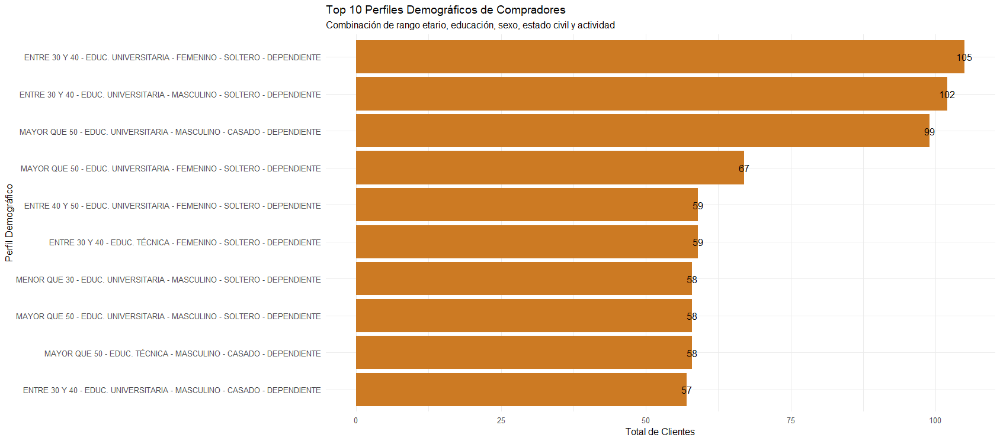
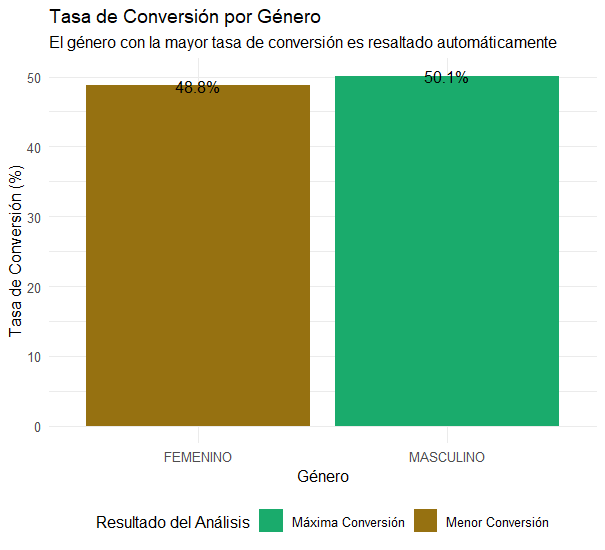
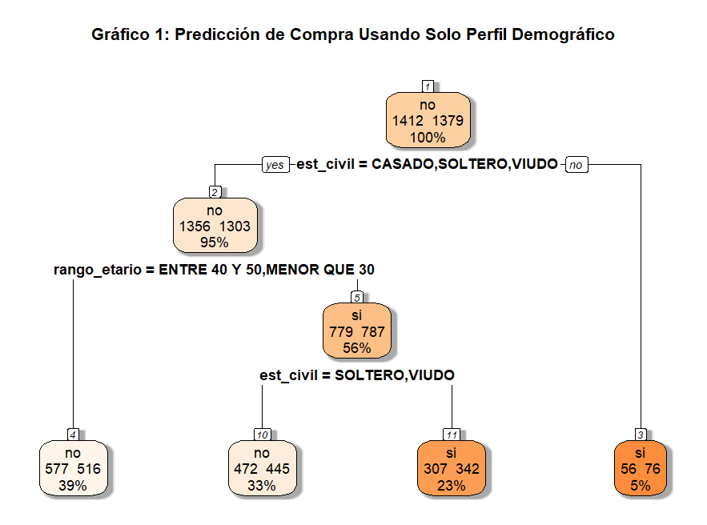
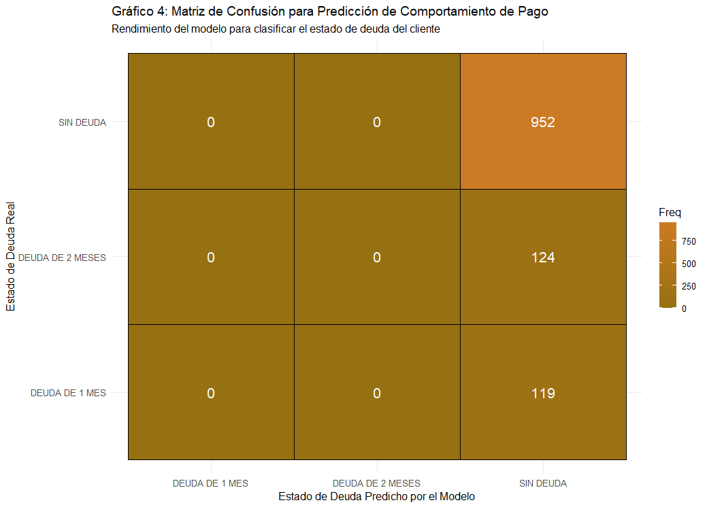

# 📊 Análisis de Datos de Compras en Promoción

## Taller de Minería de Datos - Evaluación N°2

Este repositorio contiene el desarrollo de un análisis de datos descriptivo y predictivo sobre un conjunto de datos de compras de productos en promoción.

> **Nota:** Este proyecto fue desarrollado con fines educativos como parte de la evaluación N°2 para la asignatura de Minería de Datos.

---

### 🎯 **Objetivos del Proyecto**

El análisis se divide en dos fases principales:

1.  **Análisis Descriptivo:**
    * Identificar los productos más populares en promoción.
    * Analizar las tendencias de compra a lo largo del tiempo.
    * Segmentar a los clientes según su comportamiento de compra.
    * Visualizar las relaciones entre diferentes variables del dataset.

2.  **Análisis Predictivo:**
    * Preprocesar y preparar los datos para el modelamiento.
    * Construir un modelo de clasificación para predecir si un cliente adquirirá un producto en promoción.
    * Evaluar el rendimiento del modelo utilizando métricas clave (como precisión, recall, etc.).
    * Interpretar los resultados del modelo para extraer conclusiones de negocio.

---

### 🚀 **Resultados Destacados**

A continuación, se muestran algunas de las visualizaciones generadas durante el análisis.

#### Hallazgos Descriptivos
*Aquí puedes poner un título descriptivo para la imagen.*
**Gráfico de los 10 productos más vendidos**


**Distribución de compras por categoría**



#### Resultados del Modelo Predictivo
*Y aquí para las imágenes del modelo.*
**Matriz de Confusión del Modelo**


**Curva ROC para evaluar el rendimiento**


---

### 🛠️ **Tecnologías Utilizadas**

* **Lenguaje de Programación:** R
* **Entorno de Desarrollo:** RStudio
* **Librerías Principales:**
    * `dplyr` y `tidyr` para la manipulación y limpieza de datos.
    * `ggplot2` para la visualización de datos.
    * `caret` o `tidymodels` para el modelamiento predictivo y evaluación.

---

### ⚙️ **Cómo Ejecutar el Proyecto**

Para replicar este análisis, sigue los siguientes pasos:

1.  **Clona el repositorio:**
    ```bash
    git clone [https://www.youtube.com/watch?v=dnxdIzF8p3k](https://www.youtube.com/watch?v=dnxdIzF8p3k)
    ```
2.  **Abre el proyecto** en RStudio.
3.  **Instala las dependencias** ejecutando el siguiente comando en la consola de R:
    ```r
    install.packages(c("dplyr", "ggplot2", "caret", "readr"))
    ```
4.  **Ejecuta el script principal** para ver el análisis completo:
    ```r
    source("EV2_desarrollo.R")
    ```

---

### 👨‍💻 **Autora**

* **Karen Rodríguez**